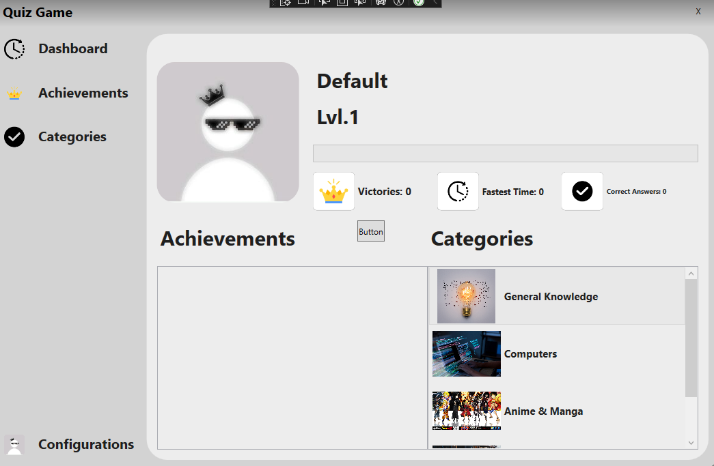
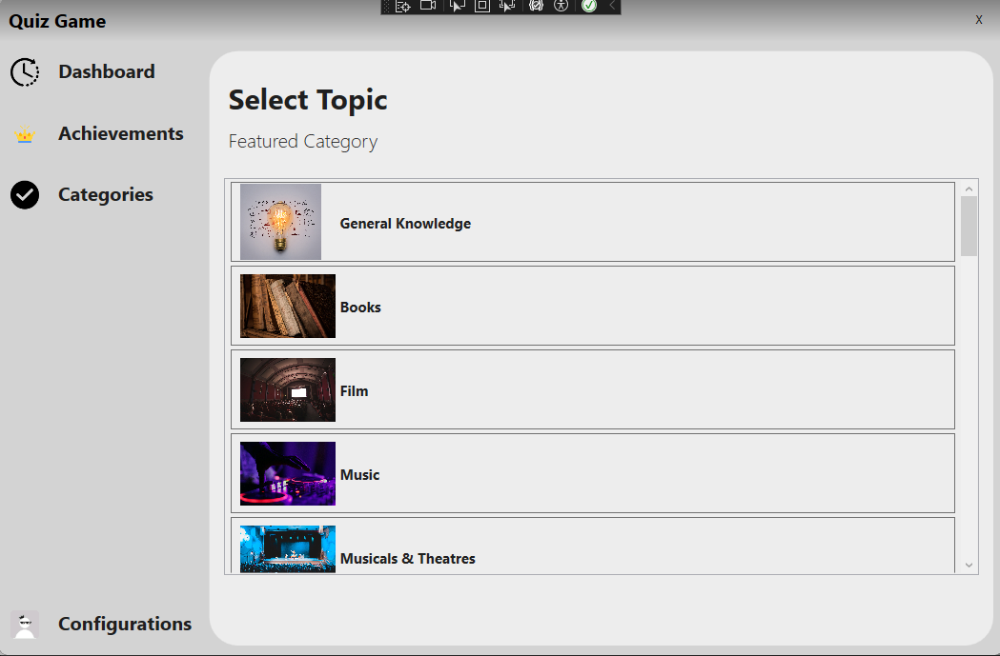

# Quiz App

Welcome to the **Quiz App**, a fun and interactive way to test your knowledge, earn EXP, and unlock achievements! What started as a project to learn about working with APIs has now evolved into an engaging game experience.

## Features
- **Quizzes**: Answer a variety of quizzes on different topics.
- **EXP System**: Earn experience points (EXP) for every correct answer.
- **Achievements**: Unlock achievements as you level up and progress in the game.
- **API Integration**: All quiz data is fetched dynamically from an API, ensuring fresh and diverse content.

## Project Purpose
This project was originally designed to:
- Explore how to interact with APIs.
- Learn about fetching, parsing, and displaying data in an app.
- Experiment with gamification elements like leveling systems and achievements.

Over time, it grew into a game that combines learning and fun!

## How to Use
1. Launch the app and create your profile.
2. Select a quiz category and start answering questions.
3. Earn EXP for correct answers and aim to unlock all achievements.
4. Check your profile to view your progress and achievements.

## What We Learned
Through this project, we:
- Gained practical experience working with APIs.
- Improved our skills in designing user interfaces and managing user profiles.
- Learned how to implement gamification mechanics to enhance user engagement.

## Future Improvements
- Add more quiz categories and questions.
- Introduce multiplayer modes to compete with friends.
- Implement a leaderboard system to track global scores.

Thank you for trying out the Quiz App! We hope you enjoy the journey of learning and leveling up.
